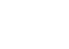
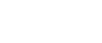

### 解题思路
看到n是1e9就知道是一道结论题。我们约定下标从1开始，就发现n号灯泡在第d轮被改变状态，当且仅当n是d的倍数。于是n的因数个数是奇数等价于灯泡是亮的。
设`d(x)`为`x`的因数个数。则我们有如下结论：
如果
 
那么
 
要使得`d(x)`为奇数，则所有`a[i]`都是偶数。于是`x`是完全平方数。所以本题等价于求1~n范围内完全平方数的个数（n=0则答案为0）。

### 代码

```cpp
class Solution {
public:
    int bulbSwitch(int n) {
        return int(sqrt(n));
    }
};
```