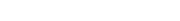
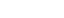
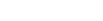

#### 方法一：最小堆

要得到从小到大的第 *n* 个丑数，可以使用**最小堆**实现。

初始时堆为空。首先将最小的丑数 *1* 加入堆。

每次取出堆顶元素 *x*，则 *x* 是堆中最小的丑数，由于 *2x, 3x, 5x* 也是丑数，因此将 *2x, 3x, 5x* 加入堆。

上述做法会导致堆中出现重复元素的情况。为了避免重复元素，可以使用哈希集合去重，避免相同元素多次加入堆。

在排除重复元素的情况下，第 *n* 次从最小堆中取出的元素即为第 *n* 个丑数。

             

```Java [sol1-Java]
class Solution {
    public int nthUglyNumber(int n) {
        int[] factors = {2, 3, 5};
        Set<Long> seen = new HashSet<Long>();
        PriorityQueue<Long> heap = new PriorityQueue<Long>();
        seen.add(1L);
        heap.offer(1L);
        int ugly = 0;
        for (int i = 0; i < n; i++) {
            long curr = heap.poll();
            ugly = (int) curr;
            for (int factor : factors) {
                long next = curr * factor;
                if (seen.add(next)) {
                    heap.offer(next);
                }
            }
        }
        return ugly;
    }
}
```

```go [sol1-Golang]
var factors = []int{2, 3, 5}

type hp struct{ sort.IntSlice }
func (h *hp) Push(v interface{}) { h.IntSlice = append(h.IntSlice, v.(int)) }
func (h *hp) Pop() interface{}   { a := h.IntSlice; v := a[len(a)-1]; h.IntSlice = a[:len(a)-1]; return v }

func nthUglyNumber(n int) int {
    h := &hp{sort.IntSlice{1}}
    seen := map[int]struct{}{1: {}}
    for i := 1; ; i++ {
        x := heap.Pop(h).(int)
        if i == n {
            return x
        }
        for _, f := range factors {
            next := x * f
            if _, has := seen[next]; !has {
                heap.Push(h, next)
                seen[next] = struct{}{}
            }
        }
    }
}
```

```Python [sol1-Python3]
class Solution:
    def nthUglyNumber(self, n: int) -> int:
        factors = [2, 3, 5]
        seen = {1}
        heap = [1]

        for i in range(n - 1):
            curr = heapq.heappop(heap)
            for factor in factors:
                if (nxt := curr * factor) not in seen:
                    seen.add(nxt)
                    heapq.heappush(heap, nxt)

        return heapq.heappop(heap)
```

```JavaScript [sol1-JavaScript]
var nthUglyNumber = function(n) {
    const factors = [2, 3, 5];
    const seen = new Set();
    const heap = new MinHeap();
    seen.add(1);
    heap.insert(1);
    let ugly = 0;
    for (let i = 0; i < n; i++) {
        ugly = heap.pop();
        for (const factor of factors) {
            const next = ugly * factor;
            if (!seen.has(next)) {
                seen.add(next);
                heap.insert(next);
            }
        }
        
    }
    return ugly;
};

// 最小堆
class MinHeap {
    constructor() {
        this.heap = [];
    }

    getParentIndex(i) {
        return (i - 1) >> 1;
    }

    getLeftIndex(i) {
        return i * 2 + 1;
    }

    getRightIndex(i) {
        return i * 2 + 2;
    }

    shiftUp(index) {
        if(index === 0) { return; }
        const parentIndex = this.getParentIndex(index);
        if(this.heap[parentIndex] > this.heap[index]){
            this.swap(parentIndex, index);
            this.shiftUp(parentIndex);
        }  
    }

    swap(i1, i2) {
        const temp = this.heap[i1];
        this.heap[i1]= this.heap[i2];
        this.heap[i2] = temp;
    }

    insert(value) {
        this.heap.push(value);
        this.shiftUp(this.heap.length - 1);
    }

    pop() {
        this.heap[0] = this.heap.pop();
        this.shiftDown(0);
        return this.heap[0];
    }

    shiftDown(index) {
        const leftIndex = this.getLeftIndex(index);
        const rightIndex = this.getRightIndex(index);
        if (this.heap[leftIndex] < this.heap[index]) {
            this.swap(leftIndex, index);
            this.shiftDown(leftIndex);
        }
        if (this.heap[rightIndex] < this.heap[index]){
            this.swap(rightIndex, index);
            this.shiftDown(rightIndex);
        }
    }

    peek() {
        return this.heap[0];
    }

    size() {
        return this.heap.length;
    }
}
```

```C++ [sol1-C++]
class Solution {
public:
    int nthUglyNumber(int n) {
        vector<int> factors = {2, 3, 5};
        unordered_set<long> seen;
        priority_queue<long, vector<long>, greater<long>> heap;
        seen.insert(1L);
        heap.push(1L);
        int ugly = 0;
        for (int i = 0; i < n; i++) {
            long curr = heap.top();
            heap.pop();
            ugly = (int)curr;
            for (int factor : factors) {
                long next = curr * factor;
                if (!seen.count(next)) {
                    seen.insert(next);
                    heap.push(next);
                }
            }
        }
        return ugly;
    }
};
```

```C [sol1-C]
#define HASH_FIND_LONG(head, findint, out) HASH_FIND(hh, head, findint, sizeof(long), out)
#define HASH_ADD_LONG(head, intfield, add) HASH_ADD(hh, head, intfield, sizeof(long), add)

struct HashTable {
    long key;
    UT_hash_handle hh;
};

void insert(struct HashTable** hashTable, long ikey) {
    struct HashTable* tmp;
    HASH_FIND_LONG(*hashTable, &ikey, tmp);
    if (tmp == NULL) {
        tmp = malloc(sizeof(struct HashTable));
        tmp->key = ikey;
        HASH_ADD_LONG(*hashTable, key, tmp);
    }
}

bool count(struct HashTable** hashTable, long ikey) {
    struct HashTable* tmp;
    HASH_FIND_LONG(*hashTable, &ikey, tmp);
    return tmp == NULL;
}

struct Heap {
    long* heap;
    int heapSize;
    bool (*cmp)(long, long);
};

void init(struct Heap* obj, int n, bool (*cmp)(long, long)) {
    obj->heap = malloc(sizeof(long) * (n + 1));
    obj->heapSize = 0;
    obj->cmp = cmp;
}

bool cmp1(long a, long b) {
    return a > b;
}

void swap(long* a, long* b) {
    long tmp = *a;
    *a = *b, *b = tmp;
}

void push(struct Heap* obj, long x) {
    int p = ++(obj->heapSize), q = p >> 1;
    obj->heap[p] = x;
    while (q) {
        if (!obj->cmp(obj->heap[q], obj->heap[p])) {
            break;
        }
        swap(&(obj->heap[q]), &(obj->heap[p]));
        p = q, q = p >> 1;
    }
}

void pop(struct Heap* obj) {
    swap(&(obj->heap[1]), &(obj->heap[(obj->heapSize)--]));
    int p = 1, q = p << 1;
    while (q <= obj->heapSize) {
        if (q + 1 <= obj->heapSize) {
            if (obj->cmp(obj->heap[q], obj->heap[q + 1])) {
                q++;
            }
        }
        if (!obj->cmp(obj->heap[p], obj->heap[q])) {
            break;
        }
        swap(&(obj->heap[q]), &(obj->heap[p]));
        p = q, q = p << 1;
    }
}

long top(struct Heap* obj) {
    return obj->heap[1];
}

bool empty(struct Heap* obj) {
    return obj->heapSize == 0;
}

int nthUglyNumber(int n) {
    int factors[3] = {2, 3, 5};
    struct HashTable* hashTable = NULL;
    insert(&hashTable, 1);
    struct Heap* heap = malloc(sizeof(struct Heap));
    init(heap, n * 3, cmp1);
    push(heap, 1);
    int ugly = 0;
    for (int i = 0; i < n; i++) {
        long curr = top(heap);
        pop(heap);
        ugly = (int)curr;
        for (int i = 0; i < 3; i++) {
            long next = curr * factors[i];
            if (count(&hashTable, next)) {
                insert(&hashTable, next);
                push(heap, next);
            }
        }
    }
    return ugly;
}
```

**复杂度分析**

- 时间复杂度： 。得到第 *n* 个丑数需要进行 *n* 次循环，每次循环都要从最小堆中取出 *1* 个元素以及向最小堆中加入最多 *3* 个元素，因此每次循环的时间复杂度是  ，总时间复杂度是  。

- 空间复杂度：*O(n)*。空间复杂度主要取决于最小堆和哈希集合的大小，最小堆和哈希集合的大小都不会超过 *3n*。

#### 方法二：动态规划

方法一使用最小堆，会预先存储较多的丑数，导致空间复杂度较高，维护最小堆的过程也导致时间复杂度较高。可以使用动态规划的方法进行优化。

定义数组  ，其中 ![\textit{dp}\[i\] ](./p__textit{dp}_i__.png)  表示第 *i* 个丑数，第 *n* 个丑数即为 ![\textit{dp}\[n\] ](./p__textit{dp}_n__.png) 。

由于最小的丑数是 *1*，因此 ![\textit{dp}\[1\]=1 ](./p__textit{dp}_1_=1_.png) 。

如何得到其余的丑数呢？定义三个指针 *p_2,p_3,p_5*，表示下一个丑数是当前指针指向的丑数乘以对应的质因数。初始时，三个指针的值都是 *1*。

当   时，令 ![\textit{dp}\[i\]=\min(\textit{dp}\[p_2\]\times2,\textit{dp}\[p_3\]\times3,\textit{dp}\[p_5\]\times5) ](./p__textit{dp}_i_=min_textit{dp}_p_2__times_2,_textit{dp}_p_3__times_3,_textit{dp}_p_5__times_5__.png) ，然后分别比较 ![\textit{dp}\[i\] ](./p__textit{dp}_i__.png)  和 ![\textit{dp}\[p_2\],\textit{dp}\[p_3\],\textit{dp}\[p_5\] ](./p__textit{dp}_p_2_,textit{dp}_p_3_,textit{dp}_p_5__.png)  是否相等，如果相等则将对应的指针加 *1*。

**正确性证明**

对于 *i>1*，在计算 ![\textit{dp}\[i\] ](./p__textit{dp}_i__.png)  时，指针   的含义是使得 ![\textit{dp}\[j\]\timesx>\textit{dp}\[i-1\] ](./p__textit{dp}_j__times_x_textit{dp}_i-1__.png)  的最小的下标 *j*，即当   时 ![\textit{dp}\[j\]\timesx>\textit{dp}\[i-1\] ](./p__textit{dp}_j__times_x_textit{dp}_i-1__.png) ，当 *j<p_x* 时 ![\textit{dp}\[j\]\timesx\le\textit{dp}\[i-1\] ](./p__textit{dp}_j__times_x_le_textit{dp}_i-1__.png) 。

因此，对于 *i>1*，在计算 ![\textit{dp}\[i\] ](./p__textit{dp}_i__.png)  时，![\textit{dp}\[p_2\]\times2,\textit{dp}\[p_3\]\times3,\textit{dp}\[p_5\]\times5 ](./p__textit{dp}_p_2__times_2,textit{dp}_p_3__times_3,textit{dp}_p_5__times_5_.png)  都大于 ![\textit{dp}\[i-1\] ](./p__textit{dp}_i-1__.png) ，![\textit{dp}\[p_2-1\]\times2,\textit{dp}\[p_3-1\]\times3,\textit{dp}\[p_5-1\]\times5 ](./p__textit{dp}_p_2-1__times_2,textit{dp}_p_3-1__times_3,textit{dp}_p_5-1__times_5_.png)  都小于或等于 ![\textit{dp}\[i-1\] ](./p__textit{dp}_i-1__.png) 。令 ![\textit{dp}\[i\]=\min(\textit{dp}\[p_2\]\times2,\textit{dp}\[p_3\]\times3,\textit{dp}\[p_5\]\times5) ](./p__textit{dp}_i_=min_textit{dp}_p_2__times_2,_textit{dp}_p_3__times_3,_textit{dp}_p_5__times_5__.png) ，则 ![\textit{dp}\[i\]>\textit{dp}\[i-1\] ](./p__textit{dp}_i__textit{dp}_i-1__.png)  且 ![\textit{dp}\[i\] ](./p__textit{dp}_i__.png)  是大于 ![\textit{dp}\[i-1\] ](./p__textit{dp}_i-1__.png)  的最小的丑数。

在计算 ![\textit{dp}\[i\] ](./p__textit{dp}_i__.png)  之后，会更新三个指针 *p_2,p_3,p_5*，更新之后的指针将用于计算 ![\textit{dp}\[i+1\] ](./p__textit{dp}_i+1__.png) ，同样满足 ![\textit{dp}\[i+1\]>\textit{dp}\[i\] ](./p__textit{dp}_i+1__textit{dp}_i__.png)  且 ![\textit{dp}\[i+1\] ](./p__textit{dp}_i+1__.png)  是大于 ![\textit{dp}\[i\] ](./p__textit{dp}_i__.png)  的最小的丑数。

      

```Java [sol2-Java]
class Solution {
    public int nthUglyNumber(int n) {
        int[] dp = new int[n + 1];
        dp[1] = 1;
        int p2 = 1, p3 = 1, p5 = 1;
        for (int i = 2; i <= n; i++) {
            int num2 = dp[p2] * 2, num3 = dp[p3] * 3, num5 = dp[p5] * 5;
            dp[i] = Math.min(Math.min(num2, num3), num5);
            if (dp[i] == num2) {
                p2++;
            }
            if (dp[i] == num3) {
                p3++;
            }
            if (dp[i] == num5) {
                p5++;
            }
        }
        return dp[n];
    }
}
```

```JavaScript [sol2-JavaScript]
var nthUglyNumber = function(n) {
    const dp = new Array(n + 1).fill(0);
    dp[1] = 1;
    let p2 = 1, p3 = 1, p5 = 1;
    for (let i = 2; i <= n; i++) {
        const num2 = dp[p2] * 2, num3 = dp[p3] * 3, num5 = dp[p5] * 5;
        dp[i] = Math.min(Math.min(num2, num3), num5);
        if (dp[i] === num2) {
            p2++;
        }
        if (dp[i] === num3) {
            p3++;
        }
        if (dp[i] === num5) {
            p5++;
        }
    }
    return dp[n];
};
```

```go [sol2-Golang]
func nthUglyNumber(n int) int {
    dp := make([]int, n+1)
    dp[1] = 1
    p2, p3, p5 := 1, 1, 1
    for i := 2; i <= n; i++ {
        x2, x3, x5 := dp[p2]*2, dp[p3]*3, dp[p5]*5
        dp[i] = min(min(x2, x3), x5)
        if dp[i] == x2 {
            p2++
        }
        if dp[i] == x3 {
            p3++
        }
        if dp[i] == x5 {
            p5++
        }
    }
    return dp[n]
}

func min(a, b int) int {
    if a < b {
        return a
    }
    return b
}
```

```Python [sol2-Python3]
class Solution:
    def nthUglyNumber(self, n: int) -> int:
        dp = [0] * (n + 1)
        dp[1] = 1
        p2 = p3 = p5 = 1

        for i in range(2, n + 1):
            num2, num3, num5 = dp[p2] * 2, dp[p3] * 3, dp[p5] * 5
            dp[i] = min(num2, num3, num5)
            if dp[i] == num2:
                p2 += 1
            if dp[i] == num3:
                p3 += 1
            if dp[i] == num5:
                p5 += 1
        
        return dp[n]
```

```C++ [sol2-C++]
class Solution {
public:
    int nthUglyNumber(int n) {
        vector<int> dp(n + 1);
        dp[1] = 1;
        int p2 = 1, p3 = 1, p5 = 1;
        for (int i = 2; i <= n; i++) {
            int num2 = dp[p2] * 2, num3 = dp[p3] * 3, num5 = dp[p5] * 5;
            dp[i] = min(min(num2, num3), num5);
            if (dp[i] == num2) {
                p2++;
            }
            if (dp[i] == num3) {
                p3++;
            }
            if (dp[i] == num5) {
                p5++;
            }
        }
        return dp[n];
    }
};
```

```C [sol2-C]
int nthUglyNumber(int n) {
    int dp[n + 1];
    dp[1] = 1;
    int p2 = 1, p3 = 1, p5 = 1;
    for (int i = 2; i <= n; i++) {
        int num2 = dp[p2] * 2, num3 = dp[p3] * 3, num5 = dp[p5] * 5;
        dp[i] = fmin(fmin(num2, num3), num5);
        if (dp[i] == num2) {
            p2++;
        }
        if (dp[i] == num3) {
            p3++;
        }
        if (dp[i] == num5) {
            p5++;
        }
    }
    return dp[n];
}
```

**复杂度分析**

- 时间复杂度：*O(n)*。需要计算数组   中的 *n* 个元素，每个元素的计算都可以在 *O(1)* 的时间内完成。

- 空间复杂度：*O(n)*。空间复杂度主要取决于数组   的大小。